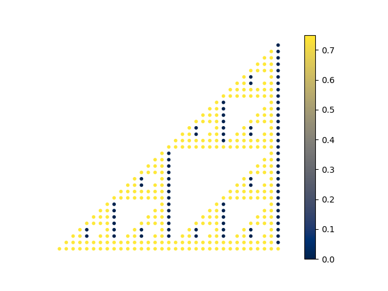

This project is about solving BdG equations on different graphs and calculating relevant physical quantities, such as superfluid density.

The idea behind it is that by engineering fractal lattices one can increase critical temperature of the superconducting transition without destroying the long-range phase coherence.

