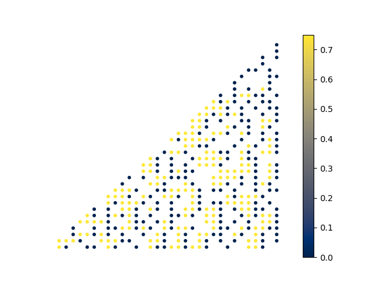

This project is about solving BdG equations on different graphs and calculating relevant physical quantities, such as superfluid density.

The idea behind it is that by engineering fractal lattices one can increase critical temperature of the superconducting transition without destroying the long-range phase coherence.

Fig.1 Superfluid stiffness for the attractive Hubbard model on a Sierpinski gasket lattice in the superconducting phase. Fractality leads to an increase in Tc by a factor of about 1.4 for the given parameters (t=1, U=2, half-filling). Yellow sites mark regions with non-zero stiffness. Their connectivity in a large cluster indicates that global supercurrent thorugh the sample is possible.

Fig.2 Superfluid stiffness for the attractive Hubbard model on a triangular lattice with randomly removed sites. While the random disorder also considerably enhances Tc, many sites acquire zero stiffness and isolate superconducting islands from each other, hence destroying superconductivity as a global coherent phenomenon.
